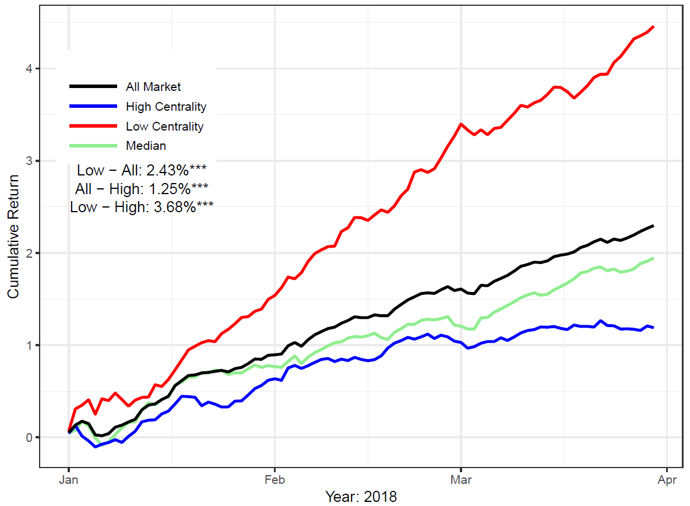

[](http://quantlet.de/index.php?p=info)

## [](http://quantlet.de/) **CASCportfolio** [](http://quantlet.de/d3/ia)

```yaml

Name of QuantLet : CASCportfolio

Published in: A Dynamic Network Perspective on the Latent Group Structure of Cryptocurrencies

Description : 'Produces plots of cumulative portfolio returns using contrarian strategy for Cryptocurrencies'

Keywords : Portfolio, Cryptocurrency, return predictability, dynamic network, community detection, centrality

Author : Li GUO, Yubo TAO

Submitted : Thu, June 14 2018 by Li GUO

Datafile : portfolio_data.RData

Output : CryptoPortfolio.png


```



### R Code:
```r
setwd("c:/~")
packs = c("ggplot2","zoo","data.table")
lapply(packs,library,character.only = TRUE)

gcut = function(x, n) {
    x[which(is.na(x))] = 0
    findInterval(x, quantile(sort(x),seq(0,1,length = n + 1)),all.inside = T)
}

meanx = function(x){
    x = as.numeric(as.character(x))
    x = x[!is.na(x)]
    mean(x)
}

portfolio_ret = function(pp = pp,udate = udate,returnweek = returnweek, qacc = "qsent"){
    retp = matrix(rep(NA,length(pp)*length(udate)),ncol = length(pp))
    for (jj in pp){
        for (ii in udate){
            iin  = which(udate == ii)
            xx   = returnweek[date == ii,]
            rett = xx[eval(as.name(qacc)) == jj, wret]
      
            retp[iin,which(pp == jj)] = meanx(rett)
        }    
        retp[which(is.na(retp[,which(pp == jj)])),which(pp == jj)] = 0
    }
    data.frame(udate,retp)
}

group_return = function(indt = "G1"){
    gsentt     = retFinal2[groupid == indt,.(crypto,date,ret,wret,lag_ret,qsent)]
    udate      = unique(gsentt[,date])
    udate      = as.character(sort(as.numeric(udate)))
    returnweek = gsentt[,.(crypto,date,ret,wret,lag_ret,qsent)]
    gsent_port = portfolio_ret(pp = pp,udate = udate,returnweek = returnweek, qacc = "qsent")
  
}

#winsorize extreme values.
winsort    = function(x,p = 0.01){
  x        = x[!is.na(x)]
  q95      = quantile(x,(1-p/2),type = 3)
  q5       = quantile(x,(p/2),type = 3)
  x[x>q95] = q95
  x[x<q5]  = q5
  x
} 


load("portfolio_data.RData")    
pp = c(1:5)   

retFinal2[, qsent := gcut(lag_ret,length(pp)), by = date]


gsentt = retFinal2[,.(crypto,date,ret,lag_ret,qsent)]
pp     = c(1:5)
retFinal2[, wret := winsort(ret,0.01)]

udate  = unique(gsentt[,date])
udate  = as.character(sort(as.numeric(udate)))
G1sent = group_return("G1")
G2sent = group_return("G2")
G3sent = group_return("G3")
G4sent = group_return("G4")
G5sent = group_return("G5")
Gall   = portfolio_ret(pp = pp,udate = udate,returnweek = retFinal2, qacc = "qsent")
allport= Gall[,2] - Gall[,dim(Gall)[2]]
G1port = G1sent[,2] - G1sent[,dim(G1sent)[2]]
G2port = G2sent[,2] - G2sent[,dim(G2sent)[2]]
G3port = G3sent[,2] - G3sent[,dim(G3sent)[2]]
G4port = G4sent[,2] - G4sent[,dim(G4sent)[2]]
G5port = G5sent[,2] - G5sent[,dim(G5sent)[2]]

group_port = cbind(G1port,G2port,G3port,G4port,G5port)
datestd    = "20150701"

groupf  = apply(group_port,1,mean)

oosdate = 20180101
G1sent  = G1sent[as.numeric(as.character(G1sent$udate))>= oosdate,]
G2sent  = G2sent[as.numeric(as.character(G2sent$udate))>= oosdate,]
G3sent  = G3sent[as.numeric(as.character(G3sent$udate))>= oosdate,]
G4sent  = G4sent[as.numeric(as.character(G4sent$udate))>= oosdate,]
G5sent  = G5sent[as.numeric(as.character(G5sent$udate))>= oosdate,]

Date       = retFinal2[,date]
Date       = as.character(sort(as.numeric(unique(Date))))
group_port = cbind(G1port,G2port,G3port,G4port,G5port)
groupf     = apply(group_port,1,mean)
DataF      = data.frame(Date,group_port,groupf)

portfolioFinal1   = DataF[as.numeric(Date)>= oosdate,]
portfolioFinal1   = as.data.table(portfolioFinal1)
median_group      = portfolioFinal1[,.(G2port,G4port,G5port)]
median_group      = as.data.frame(median_group) 
Median_centrality = apply(median_group,1,mean)
High_centrality   = portfolioFinal1[,G3port]
Low_centrality    = portfolioFinal1[,G1port]
Date              = portfolioFinal1[, Date]
Date              = as.Date(as.character(Date),"%Y%m%d")
All               = portfolioFinal1[,groupf]

arbF = data.frame(Date,Low_centrality,Median_centrality,High_centrality,All)


unrate.df = data.frame(date=Date, SP500 = All,Low = Low_centrality, 
                       Mid = Median_centrality, High = High_centrality)
t.test(unrate.df$Low - unrate.df$SP500)
t.test(unrate.df$SP500 - unrate.df$High)
t.test(unrate.df$Low - unrate.df$High)

unrate.df$Low   = cumsum(unrate.df$Low )
unrate.df$High  = cumsum(unrate.df$High )
unrate.df$Mid   = cumsum(unrate.df$Mid )
unrate.df$SP500 = cumsum(unrate.df$SP500 )

ggplot(unrate.df) +  
    geom_line(aes(x=Date,y=unrate.df$Low,col= paste("Low Centrality")),linetype=1,size = 1) +
    geom_line(aes(x=Date,y=unrate.df$Mid,col= paste("Median")),linetype=1,size = 1) +
    geom_line(aes(x=Date,y=unrate.df$High,col= paste("High Centrality")),linetype=1,size = 1) +
    geom_line(aes(x=date,y=unrate.df$SP500,col= paste("All Market")),linetype=1,size = 1) +
  
    annotate("text", x = c(as.Date("2018-01-12")), y=2.9, label = paste("Low - All: 2.43%***"))+
    annotate("text", x = c(as.Date("2018-01-12")), y=2.7, label = paste("All - High: 1.25%***"))+
    annotate("text", x = c(as.Date("2018-01-12")), y=2.5, label = paste("Low - High: 3.68%***"))+
  
    theme_bw() + 
  
    scale_color_manual("",values    = c("Low Centrality"  = "red","Median" = "lightgreen","High Centrality"    = "blue","All Market" = "black")) +
    scale_linetype_manual("",values = c(1,11)) +
    scale_linetype_manual("",values = c(1,11)) +
  
    ylab("Cumulative Return") + 
    xlab("Year: 2018") +
    guides(fill     = guide_legend(keywidth= 1, keyheight = 1),
         linetype =guide_legend(keywidth = 3, keyheight = 1),
         colour   =guide_legend(keywidth = 3, keyheight = 1)) + 
    theme(legend.position = c(0.15, 0.78))

```
