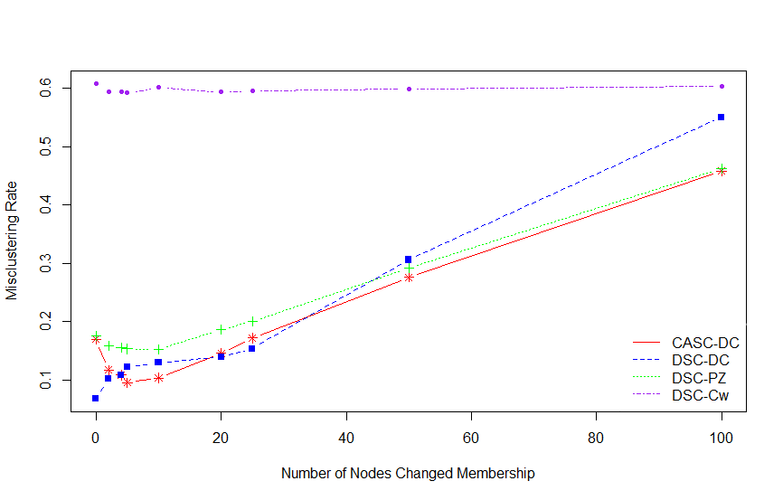
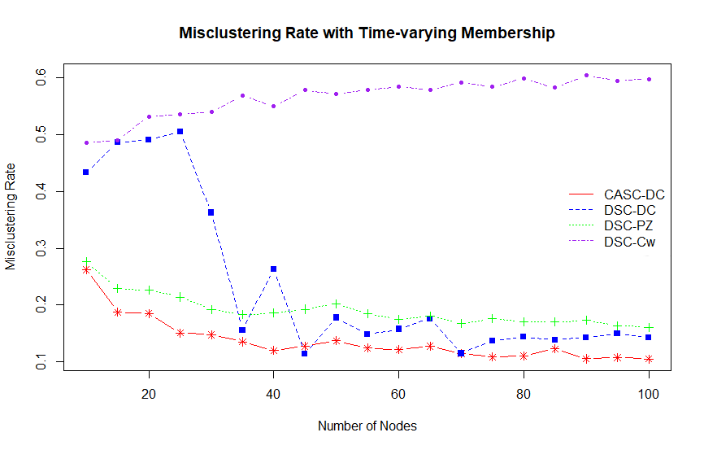

[](http://quantlet.de/index.php?p=info)

## [](http://quantlet.de/) **CASCsimulation** [](http://quantlet.de/d3/ia)

```yaml

Name of QuantLet : CASCsimulation

Published in: A Dynamic Network Perspective on the Latent Group Structure of Cryptocurrencies

Description : 'Produces simulation plots of misclustering rate under various model specifications'

Keywords : Dynamic network, community detection, covariate assisted spectral clusterring, Cryptocurrency

Author : Li GUO, Yubo TAO

Submitted : Thu, June 14 2018 by Li GUO

Datafile : 

Output : CASCSwcMemb.png, CASCMemNodes.png


```





### R Code:
```r
setwd("C:/~")
pack  =  c("cluster", "combinat","expm","doParallel")
#library(cluster)    : for function 'pam', i.e. k-medoids clustering 
#library(combinat)   : for function 'permn'
#library(expm)       : for function %^%
#library(doParallel) : parallel computing

lapply(pack, function(x) if (!(x %in% installed.packages())) {
    install.packages(x)
})
lapply(pack, library, character.only = TRUE)

rm(list=ls())

adaptBndwth = function(L_tau, C_w, alpha, t, T, N, L){
  
  if(T==1){
    r_hat  = 0
    W_ma   = 1
  }else{
    W_max  = 4
    S      = L_tau
    for(t in 1:T){
      S[,,t] = L_tau[,,t]+alpha[t]*C_w[,,t]
    }
    S_max  = max(S)
    P_adp  = array(0, c(N,N, ceiling(T/2)))
    
    r_temp = 0
    r      = 1
    cnt    = 0
    while(r<=ceiling(T/2)){
      cnt        = cnt+1
      tmp        = DcrtKernel(L_tau, C_w, alpha, r, t, L)
      P_adp[,,r] = tmp$P_hat
      
      for(rho in 1:(r-1)){
        threshold       = 4*W_max*sqrt(N*S_max/max(c(rho,1)))
        if(r==1){
          diff_norm   = norm(P_adp[,,r]-S[,,t])
        }else{ 
          diff_norm   = norm(P_adp[,,r]-P_adp[,,rho])
        }
        if(diff_norm>threshold){
          r_temp[cnt] = 0
          break
        }
        r_temp[cnt] = r
      }
      r = r+1
    }
    r_hat = max(r_temp)
  }
  
  return(r_hat)
}


DcrtKernel = function(L_tau, C_w, alpha, r, t, L){
  
  T  = dim(L_tau)[3]
  
  m  = L/2
  
  a1 = solveCoeff(r, L, 1) 
  a2 = solveCoeff(r, L, 2)  
  a3 = solveCoeff(r, L, 3)  
  
  
  if(r>0){
    if(t<=r){
      W	   = rep(NA, r+1)
      P_temp = array(NA, c(dim(C_w)[1:2], r+1))
      for(i in 0:r){
        W[i+1] 	      = sum(t(a1)*r^seq(0,-L,-2)*i^seq(0,L,2))
        P_temp[,,i+1] = W[i+1]*(L_tau[,,t+i]+alpha[t+i]*C_w[,,t+i])
      }
      P_hat  = apply(P_temp, c(1,2), mean)
    }else if(t<=T-r && t>r){
      W      = rep(NA, 2*r+1)
      P_temp = array(NA, c(dim(C_w)[1:2], 2*r+1))
      for(i in -r:r){
        W[i+r+1]        = sum(t(a2)*r^seq(0,-L,-2)*i^seq(0,L,2))
        P_temp[,,i+r+1] = W[i+r+1]*(L_tau[,,t+i]+alpha[t+i]*C_w[,,t+i])
      }
      P_hat  = apply(P_temp, c(1,2), mean)
    }else{
      W      = rep(NA, r+1)
      P_temp = array(NA, c(dim(C_w)[1:2], r+1))
      for(i in -r:0){
        W[i+r+1]        = sum(t(a3)*r^seq(0,-L,-2)*i^seq(0,L,2))
        P_temp[,,i+r+1] = W[i+r+1]*(L_tau[,,t+i]+alpha[t+i]*C_w[,,t+i])
      }
      P_hat  = apply(P_temp, c(1,2), mean)
    }
  }else{
    P_hat = L_tau[,,t]+alpha[t]*C_w[,,t]
  }
  
  return(list(P_hat=P_hat, W=W))
}


est_TuningParam = function(A,X,K){
  
  require(expm)
  
  N = dim(A)[1]
  T = dim(A)[3]
  R = dim(X)[2]
  
  L_tau = array(0, dim=c(N,N,T))
  C_w   = array(0, dim=c(N,N,T))
  
  Lambda_L = matrix(NA, N,T)
  Lambda_X = Lambda_L
  for(t in 1:T){
    D    	   = diag(rowSums(A[,,t]))
    tau  	   = mean(diag(D))
    D_tau	   = D+tau*diag(N)
    tmp   	   = D_tau%^%(-1/2)
    L_tau[,,t] = tmp%*%A[,,t]%*%tmp
    C_w[,,t]   = (X%*%t(X))%*%L_tau[,,t]%*%(X%*%t(X))
    
    Lambda       = eigen(L_tau[,,t])
    Lambda_L[,t] = sort(abs(Lambda$values), decreasing = TRUE)
    
    Lambda_C     = eigen(C_w[,,t])
    Lambda_X[,t] = sort(abs(Lambda_C$values), decreasing = TRUE)
  }
  alpha_min = (Lambda_L[K,]-Lambda_L[K+1,])/Lambda_X[1,]
  alpha     = alpha_min
  return(alpha)
}


solveCoeff = function(r, L, flag){
  A = matrix(0, L/2+1, L/2+1)
  if(flag==1){
    F = 0:r
    B = c(length(F), rep(0, L/2))
    
    if(r==0 || r==1){
      a = c(length(F), rep(0, L/2))
    }else{
      for(k in seq(0,L,2)){
        for(j in 0:(L/2)){
          A[k/2+1,j+1] = r^(-2*j)*sum(F^(k+2*j))
        }
      }
      a = solve(A,B)  
    }
  }else if(flag==2){
    F = (-r):r
    B = c(length(F), rep(0, L/2))
    
    if(r==0 || r==1){
      a = c(length(F), rep(0, L/2))
    }else{
      for(k in seq(0,L,2)){
        for(j in 0:(L/2)){
          A[k/2+1,j+1] = r^(-2*j)*sum(F^(k+2*j))
        }
      }
      a = solve(A,B)
    }
  }else{
    
    F = (-r):0
    B = c(length(F), rep(0, L/2))
    
    if(r==0 || r==1){
      a = c(length(F), rep(0, L/2))
    }else{
      for(k in seq(0,L,2)){
        for(j in 0:(L/2)){
          A[k/2+1,j+1] = r^(-2*j)*sum(F^(k+2*j))
        }
      }
      a = solve(A,B) 
    }
  }
  
  return(a)
}


CovSpecCluster_parallel=function(A,X,K,L,alpha, Flag){
  
  require(expm)
  N     = dim(A)[1]
  T     = dim(A)[3]
  R     = dim(X)[2]
  
  r_hat = rep(0,T)
  
  L_tau = array(0, c(N,N,T))
  C_w   = array(0,c(N,N,T))
  
  for(t in 1:T){
    D          = diag(rowSums(A[,,t]))
    tau        = mean(diag(D))
    D_tau      = D+tau*diag(N)
    tmp        = D_tau%^%(-1/2)
    L_tau[,,t] = tmp %*% A[,,t] %*% tmp
    C_w[,,t]   = (X%*%t(X))%*%L_tau[,,t]%*%(X%*%t(X))
  }
  
  Z = array(NA, c(N,K,T))
  
  for(t in 1:T){    #<<<<=-------------
    Z_tmp = matrix(0, N, K)
    r_tmp = adaptBndwth(L_tau, C_w, alpha, t, T, N, L)
    tmp   = DcrtKernel(L_tau, C_w, alpha, r_tmp, t, L)
    P_hat = tmp$P_hat
    
    r_hat[t] = r_tmp
    tmp	 = eigen(P_hat)
    Lambda   = tmp$values
    V	 = tmp$vectors
    I	 = order(abs(Lambda), decreasing = TRUE)
    
    U_hat  = Re(V[, I[1:K]])
    I_plus = which(sqrt(rowSums(U_hat^2))>0)
    I_0    = which(sqrt(rowSums(U_hat^2))==0)
    
    if(Flag!=0){
      U_plus=matrix(0, length(I_plus), K)
      for(j in 1:length(I_plus)){
        U_plus[j,]=U_hat[I_plus[j],]/norm(U_hat[I_plus[j],], type="2")
      }
      IDX = kmeans(U_plus, K, iter.max = 1000, nstart=10)
      IDX = IDX[[1]]
    }else{
      IDX = kmeans(U_hat[I_plus,], K, iter.max = 1000, nstart=10)
      IDX = IDX[[1]]
    }
    
    if(length(I_0)>0){
      Z_tmp[I_0,1] = 1
      for(i in 1:length(IDX)){
        Z_tmp[I_plus[i], IDX[i]] = 1
      }
      show(t)
    }else{
      for(i in 1:length(IDX)){
        Z_tmp[I_plus[i], IDX[i]]=1
      }
    }
    Z[,,t] = Z_tmp
  }
  return(list(Z=Z, r_hat=r_hat))
}


DynSpecCluster = function(A,K,Flag){
  
  require(expm)
  require(cluster)
  
  N = dim(A)[1]
  T = dim(A)[3]
  
  Z_hat   = matrix(0, N,K)
  Z_tilde = Z_hat
  U_hat   = Z_hat
  U_tilde = Z_hat
  
  A_1     = array(0, c(N,N,T))
  B       = A_1
  
  if(Flag==0){
    
    tmp     = eigen(apply(A, c(1,2), sum))
    Lambda1 = tmp$values
    V1 	= tmp$vectors
    I1	= order(abs(Lambda1), decreasing = TRUE)
    U_hat   = V1[,I1[1:K]]
    IDX1    = kmeans(U_hat, K, iter.max = 1000, nstart=10)
    IDX1    = IDX1$cluster
    
    for(t in 1:T){
      A_1[,,t] = A[,,t]%^%2
      B[,,t]   = A_1[,,t]-diag(diag(A_1[,,t]))
    }
    
    tmp     = eigen(apply(B, c(1,2), sum))
    Lambda2 = tmp$values
    V2      = tmp$vectors
    I2      = order(abs(Lambda2), decreasing = TRUE)
    U_tilde = V2[,I2[1:K]]
    IDX2    = kmeans(U_tilde, K, iter.max = 1000, nstart=10)
    IDX2    = IDX2$cluster
    
    for(i in 1:length(IDX1)){
      Z_hat[i, IDX1[i]]  = 1
    }
    for(i in 1:length(IDX2)){
      Z_tilde[i,IDX2[i]] = 1
    }
    
  }else{
    for(t in 1:T){
      A_1[,,t] = A[,,t]%^%2
      B[,,t]   = A_1[,,t]-diag(diag(A_1[,,t]))
    }
    
    tmp      = eigen(apply(A, c(1,2), sum))
    Lambda1  = tmp$values
    V1 	     = tmp$vectors
    I1       = order(abs(Lambda1), decreasing = TRUE)
    
    U_breve1 = V1[,I1[1:K]]
    I_plus1  = which(sqrt(rowSums(U_breve1^2))>0)
    I_01     = which(sqrt(rowSums(U_breve1^2))==0)
    
    U_plus1  = matrix(0, length(I_plus1), K)
    for(j in 1:length(I_plus1)){
      U_plus1[j,] = U_breve1[I_plus1[j],]/norm(U_breve1[I_plus1[j],],"2")
    }
    
    tmp      = eigen(apply(B, c(1,2), sum))
    Lambda2  = tmp$values
    V2       = tmp$vectors
    I2       = order(abs(Lambda2), decreasing = TRUE)
    
    U_breve2 = V2[,I2[1:K]]
    I_plus2  = which(sqrt(rowSums(U_breve2^2))>0)
    I_02     = which(sqrt(rowSums(U_breve2^2))==0)
    
    U_plus2  = matrix(0, length(I_plus2), K)
    for(j in 1:length(I_plus2)){
      U_plus2[j,] = U_breve2[I_plus2[j],]/norm(U_breve2[I_plus2[j],],"2")
    }
    
    IDX1 = pam(U_plus1, K)
    IDX1 = IDX1$clustering
    IDX2 = pam(U_plus2, K)
    IDX2 = IDX2$clustering
    
    for(i in 1:length(IDX1)){
      Z_hat[I_plus1[i], IDX1[i]]      = 1
    }
    for(i in 1:length(IDX2)){
      Z_tilde[I_plus2[i], IDX2[i]]    = 1
    }
    if(length(I_01)>0){Z_hat[I_01, 1]   = 1}
    if(length(I_02)>0){Z_tilde[I_02, 1] = 1}
  }
  
  
  return(list(Z_hat=Z_hat, Z_tilde=Z_tilde))
}


DynSpecCluster_Pensky = function(A,K,L){
  
  N     = dim(A)[1]
  T     = dim(A)[3]
  
  Z     = array(0, c(N,K,T))
  r_hat = rep(0, T)
  K_dc  = rep(0, T)
  Z     = array(0, c(N,K,T))
  
  for(t in 1:T){  
    Z_tmp = matrix(0, N, K)
    r_tmp = adaptBndwth(A, array(0, c(N,N,T)), rep(0,T), t, T, N, L)
    tmp   = DcrtKernel(A, array(0, c(N,N,T)), rep(0,T), r_tmp, t, L)
    P_hat = tmp$P_hat
    
    r_hat[t] = r_tmp
    tmp      = eigen(P_hat)
    Lambda   = tmp$values
    V        = tmp$vectors
    I        = order(abs(Lambda), decreasing = T)
    
    U_hat    = V[,I[1:K]]
    I_0      = which(sqrt(rowSums(U_hat^2))==0)
    I_plus   = which(sqrt(rowSums(U_hat^2))>0)
    
    IDX      = kmeans(U_hat[I_plus,], K, iter.max = 1000, nstart=10)
    IDX      = IDX$cluster
    
    if(length(I_0)>0){
      K_tmp             = K+1
      Z_tmp[I_0, K_tmp] = 1
      for(i in 1:length(IDX)){
        Z_tmp[I_plus[i], IDX[i]] = 1
      }
    }else{
      K_tmp = K
      for(i in 1:length(IDX)){
        Z_tmp[I_plus[i], IDX[i]] = 1
      }
    }
    K_dc[t] = K_tmp
    Z[,,t]  = Z_tmp
  }
  
  return(list(Z=Z, r_hat=r_hat, K_dc=K_dc, C=C))
}


SpecCluster_C = function(A, X, K){
  
  N = dim(A)[1]
  T = dim(A)[3]
  R = dim(X)[2]
  
  Z = array(0, c(N,K,T))
  
  for(t in 1:T){    
    Z_tmp  = matrix(0, N, K)
    P_hat  = X%*%t(X)
    
    tmp    = eigen(P_hat)
    Lambda = tmp$values
    V      = tmp$vectors
    I      = order(abs(Lambda), decreasing = T)
    
    U_hat  = Re(V[,I[1:K]])
    I_0    = which(sqrt(rowSums(U_hat^2))==0)
    I_plus = which(sqrt(rowSums(U_hat^2))>0)
    
    U_plus = matrix(0, length(I_plus), K)
    for(j in 1:length(I_plus)){
      U_plus[j,] = U_hat[I_plus[j],]/norm(U_hat[I_plus[j],], "2")
    }
    IDX = kmeans(U_plus, K, iter.max = 1000, nstart=10)
    IDX = IDX$cluster
    
    if(length(I_0)>0){
      Z_tmp[I_0, 1] = 1
      for(i in 1:length(IDX)){
        Z_tmp[I_plus[i], IDX[i]] = 1
      }
    }else{
      for(i in 1:length(IDX)){
        Z_tmp[I_plus[i], IDX[i]] = 1
      }
    }
    Z[,,t] = Z_tmp
  }
  return(Z)
}


clnum = detectCores()-1
cl    =  makeCluster(clnum)
registerDoParallel(cl)


K_0  = 3
N    = 100
T    = 10
L    = 4
s    = c(0, 1/50, 1/25, 1/20, 1/10, 1/5, 1/4, 1/2, 1)*N
nsim = 3
J    = 10

parallel.sim = function(K_0, N, T, L, sn, nsim, J){

    require(combinat)
  
    B              = array(0, c(K_0, K_0, T))
    MisRate_temp_2 = rep(NA, nsim)
    MisRate_temp_4 = MisRate_temp_2
    MisRate_temp_7 = MisRate_temp_2
    MisRate_temp_8 = MisRate_temp_2
  
    for(k in 1:nsim){
        R   = ceiling(log(N))
        Z_0 = array(0, c(N, K_0, T))
    
        rnd = ceiling(matrix(runif(N*T), N, T)*K_0)
        for(t in 1:T){
            for(i in 1:N){
                Z_0[i, rnd[i,t], t] = 1
            }
            if(t>1 &&  sn<=(N-1)){
                Z_0[(sn+1):N,,t] = Z_0[(sn+1):N,,t-1]
            }
            B[,,t] = matrix(c(0.9,0.6,0.3,0.6,0.3,0.4,0.3,0.4,0.8),3,3)*t/T
        }
        X = matrix(runif(N*R),N,R)*J
    
        A = array(0, c(N, N, T))
        for(t in 1:T){
            A[,,t] = Z_0[,,t]%*%B[,,t]%*%t(Z_0[,,t])
            A[,,t] = A[,,t]<0.5
      
            for(i in 1:N){
                for(j in 1:N){
                    if(i==j){
                        A[i,j,t] = 0
                    }
                }
            }
        }
    
        alpha   = est_TuningParam(A, X, K_0)
    
        tmp     = CovSpecCluster_parallel(A, X, K_0, L, alpha, 1)
        Z_tilde = tmp$Z
        r_tilde = tmp$r_hat
    
    
        tmp    = DynSpecCluster(A, K_0, 1)
        Z_dsc3 = tmp$Z_hat
        Z_dsc4 = tmp$Z_tilde
    
    
        tmp   = DynSpecCluster_Pensky(A, K_0, L)
        Z_psk = tmp$Z
    
    
        Z_C   = SpecCluster_C(A, X, K_0)
    
    
        perm  = permn(1:K_0)
        s2    = matrix(0, length(perm), T)
        s4    = s2; s7 = s2; s8 = s2
    
        for(t in 1:T){
            for( i in 1:length(perm)){
                s2[i,t] = sum(abs(Z_0[,perm[[i]],t]-Z_tilde[,,t]))/N/2
        
                s4[i,t] = sum(abs(Z_0[,perm[[i]],t]-Z_dsc4))/N/2
        
                s7[i,t] = sum(abs(Z_0[,perm[[i]],t]-Z_psk[,,t]))/N/2
        
                s8[i,t] = sum(abs(Z_0[,perm[[i]],t]-Z_C[,,t]))/N/2
            }
        }
        MisRate_temp_2[k] = mean(apply(s2, 2, min))
        MisRate_temp_4[k] = mean(apply(s4, 2, min))
        MisRate_temp_7[k] = mean(apply(s7, 2, min))
        MisRate_temp_8[k] = mean(apply(s8, 2, min))
    
    }
    return(cbind(MisRate_temp_2, MisRate_temp_4,MisRate_temp_7,MisRate_temp_8))
  
}
res  = foreach(n=1:length(s)) %dopar% parallel.sim(K_0, N, T, L, sn=s[n], nsim, J)
stopCluster(cl)


res1 = lapply(res, colMeans)

MisRate_ave_2 = unlist(lapply(res1, "[[", 1))
MisRate_ave_4 = unlist(lapply(res1, "[[", 2))
MisRate_ave_7 = unlist(lapply(res1, "[[", 3))
MisRate_ave_8 = unlist(lapply(res1, "[[", 4))

#save.image("Sim_UdrtSwcMem.RData")


#jpeg("fig1.jpg", width=8, height=6, units="in", res=300)
plot(s, MisRate_ave_2, ylim=range(c(MisRate_ave_2, MisRate_ave_4,
                                    MisRate_ave_7, MisRate_ave_8)),
     typ="b", col="red", pch=8, lwd=1.5, lty="solid",
     ylab="Misclustering Rate", xlab="Number of Nodes Changed Membership")
lines(s, MisRate_ave_4, typ="b", col="blue", pch=15, lwd=1.5, lty="dashed")
lines(s, MisRate_ave_7, typ="b", col="green", pch=3, lwd=1.5, lty="dotted")
lines(s, MisRate_ave_8, typ="b", col="purple", pch=20, lwd=1.5, lty="dotdash")
legend("bottomright",c("CASC-DC","DSC-DC","DSC-PZ","DSC-Cw"),
       col=c("red","blue","green","purple"), lty=c("solid","dashed","dotted","dotdash"))
#dev.off()


clnum = detectCores()-1
cl    =  makeCluster(clnum)
registerDoParallel(cl)


K_0  = 3
N    = seq(10,100,5)
T    = 10
L    = 4
J    = 10
nsim = 3

parallel.sim.node = function(K_0, Nn, T, L, J, nsim){
  
    require(combinat)
  
    B 		   = array(0, c(K_0, K_0, T))
    MisRate_temp_2 = rep(NA, nsim)
    MisRate_temp_4 = MisRate_temp_2
    MisRate_temp_7 = MisRate_temp_2
    MisRate_temp_8 = MisRate_temp_2
  
    for(k in 1:nsim){
        R     = ceiling(log(Nn))
        s     = floor(Nn^(1/2))
        Z_0   = array(0, c(Nn, K_0, T))
    
        rnd   = ceiling(matrix(runif(Nn*T), Nn, T)*K_0)
        for(t in 1:T){
            for(i in 1:Nn){
                Z_0[i, rnd[i,t], t]  = 1
            }
            if(t>1){
                Z_0[(s+1):Nn,,t] = Z_0[(s+1):Nn,,t-1]
            }    
            B[,,t] = matrix(c(0.9,0.6,0.3,0.6,0.3,0.4,0.3,0.4,0.8),3,3)*t/T
        }
        X = matrix(runif(Nn*R),Nn,R)*J
    
        A = array(0, c(Nn, Nn, T))
        for(t in 1:T){
            A[,,t] = Z_0[,,t]%*%B[,,t]%*%t(Z_0[,,t])
            A[,,t] = A[,,t]<0.5
      
            for(i in 1:Nn){
                for(j in 1:Nn){
                    if(i==j){
                        A[i,j,t] = 0
                    }
                }
            }
        }
    
        alpha   = est_TuningParam(A, X, K_0)
    
        tmp     = CovSpecCluster_parallel(A, X, K_0, L, alpha, 1)
        Z_tilde = tmp$Z
        r_tilde = tmp$r_hat
    
    
        tmp     = DynSpecCluster(A, K_0, 1)
        Z_dsc3  = tmp$Z_hat
        Z_dsc4  = tmp$Z_tilde
    
    
        tmp     = DynSpecCluster_Pensky(A, K_0, L)
        Z_psk   = tmp$Z
    
    
        Z_C	    = SpecCluster_C(A, X, K_0)
    
    
        perm    = permn(1:K_0)
        s2      = matrix(0, length(perm), T)
        s4      = s2; s7 = s2; s8 = s2
    
        for(t in 1:T){
            for( i in 1:length(perm)){
                s2[i,t] = sum(abs(Z_0[,perm[[i]],t]-Z_tilde[,,t]))/Nn/2
            
                s4[i,t] = sum(abs(Z_0[,perm[[i]],t]-Z_dsc4))/Nn/2
        
                s7[i,t] = sum(abs(Z_0[,perm[[i]],t]-Z_psk[,,t]))/Nn/2
        
                s8[i,t] = sum(abs(Z_0[,perm[[i]],t]-Z_C[,,t]))/Nn/2
            }
        }
        MisRate_temp_2[k] = mean(apply(s2, 2, min))
        MisRate_temp_4[k] = mean(apply(s4, 2, min))
        MisRate_temp_7[k] = mean(apply(s7, 2, min))
        MisRate_temp_8[k] = mean(apply(s8, 2, min))
    
    }
  
    return(cbind(MisRate_temp_2, MisRate_temp_4,MisRate_temp_7,MisRate_temp_8))
}

res = foreach(n=1:length(N)) %dopar% parallel.sim.node(K_0, Nn=N[n], T, L, J, nsim)

stopCluster(cl)


res1= lapply(res, colMeans)

MisRate_ave_2 = unlist(lapply(res1, "[[", 1))
MisRate_ave_4 = unlist(lapply(res1, "[[", 2))
MisRate_ave_7 = unlist(lapply(res1, "[[", 3))
MisRate_ave_8 = unlist(lapply(res1, "[[", 4))


#save.image("Sim_UdrtVaryMem_Nodes.RData")

#jpeg("fig2_Nodes.jpg", width=8, height=6, units="in", res=300)
plot(N, MisRate_ave_2, ylim=range(c(MisRate_ave_2, MisRate_ave_4,
                                    MisRate_ave_7, MisRate_ave_8)),
     typ="b", col="red", pch=8, lwd=1.5, lty="solid",
     xlab="Number of Nodes", ylab="Misclustering Rate", main='Misclustering Rate with Time-varying Membership')
lines(N, MisRate_ave_4, typ="b", col="blue", pch=15, lwd=1.5, lty="dashed")
lines(N, MisRate_ave_7, typ="b", col="green", pch=3, lwd=1.5, lty="dotted")
lines(N, MisRate_ave_8, typ="b", col="purple", pch=20, lwd=1.5, lty="dotdash")
legend("right",c("CASC-DC","DSC-DC","DSC-PZ","DSC-Cw"),
       col=c("red","blue","green","purple"), lty=c("solid","dashed","dotted","dotdash"))
#dev.off()

```
